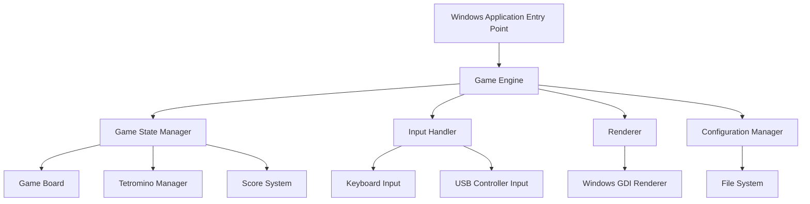

# Design Document: Tetris Game

## Overview

This design implements a classic Tetris game for Windows using C++ with a focus on incremental development and modularity. The architecture separates concerns through well-defined interfaces, allowing components to be developed and tested independently.

The system follows a traditional game loop architecture with distinct phases: input processing, game state updates, and rendering. The design emphasizes testability through pure functions for game logic and dependency injection for platform-specific components.

Key design principles:
- **Separation of concerns**: Game logic, rendering, and input handling are decoupled
- **Incremental development**: Core mechanics can be implemented first, with UI/audio added later
- **Testability**: Pure functions for game rules enable comprehensive property-based testing
- **Platform abstraction**: Windows-specific code is isolated behind interfaces

## Architecture

### High-Level Component Structure



### Component Responsibilities

**Game Engine**: Orchestrates the game loop, coordinates between components, manages timing
- Runs at fixed timestep (60 FPS target)
- Delegates input to Input Handler
- Updates Game State Manager
- Triggers Renderer each frame

**Game State Manager**: Maintains current game state, enforces state transitions
- Manages state enum (Menu, Playing, Paused, GameOver)
- Validates state transitions
- Coordinates between Game Board, Tetromino Manager, and Score System

**Game Board**: Represents the 10x20 grid, handles line clearing
- Stores fixed blocks as 2D array
- Detects filled rows
- Clears rows and shifts blocks down
- Checks for game over conditions

**Tetromino Manager**: Handles tetromino generation, movement, rotation
- Generates random tetrominoes using bag randomization
- Maintains active tetromino position and orientation
- Validates movements against board state
- Implements wall kick system for rotations

**Score System**: Calculates points, tracks level progression
- Awards points based on lines cleared (1 line = 100, 2 = 300, 3 = 500, 4 = 800)
- Increments level every 10 lines
- Calculates drop speed based on level
- Persists high scores

**Input Handler**: Processes keyboard and USB controller input
- Polls input devices each frame
- Maps raw input to game actions
- Supports simultaneous input from multiple devices
- Handles key repeat for continuous movement

**Renderer**: Draws game state to screen
- Renders game board with colored blocks
- Draws active tetromino
- Displays UI elements (score, level, next piece)
- Shows pause/game over overlays

**Configuration Manager**: Handles persistence of settings and scores
- Loads configuration from file on startup
- Saves high scores and settings
- Provides default values when file missing
- Validates configuration data

## Components and Interfaces

### Core Data Structures

```cpp
enum class TetrominoType {
    I, O, T, S, Z, J, L
};

enum class GameState {
    Menu,
    Playing,
    Paused,
    GameOver
};

struct Position {
    int x;
    int y;
};

struct Tetromino {
    TetrominoType type;
    Position position;
    int rotation;  // 0-3 for four orientations
    
    // Returns the 4 block positions for current rotation
    std::array<Position, 4> getBlockPositions() const;
};

struct GameBoard {
    static constexpr int WIDTH = 10;
    static constexpr int HEIGHT = 20;
    
    std::array<std::array<std::optional<TetrominoType>, WIDTH>, HEIGHT> cells;
    
    bool isOccupied(int x, int y) const;
    bool isValidPosition(const Tetromino& tetromino) const;
    std::vector<int> getFilledRows() const;
    void clearRows(const std::vector<int>& rows);
    void fixTetromino(const Tetromino& tetromino);
};

struct GameScore {
    int score;
    int level;
    int linesCleared;
    
    void addLines(int count);
    int getDropSpeed() const;  // Returns milliseconds per drop
};
```

### Interface Definitions

```cpp
// Abstract input interface for testability
class IInputProvider {
public:
    virtual ~IInputProvider() = default;
    
    virtual bool isLeftPressed() const = 0;
    virtual bool isRightPressed() const = 0;
    virtual bool isDownPressed() const = 0;
    virtual bool isRotatePressed() const = 0;
    virtual bool isPausePressed() const = 0;
};

// Abstract renderer interface for testability
class IRenderer {
public:
    virtual ~IRenderer() = default;
    
    virtual void renderBoard(const GameBoard& board) = 0;
    virtual void renderTetromino(const Tetromino& tetromino) = 0;
    virtual void renderScore(const GameScore& score) = 0;
    virtual void renderNextPiece(TetrominoType type) = 0;
    virtual void renderPauseOverlay() = 0;
    virtual void renderGameOverOverlay(int finalScore) = 0;
    virtual void renderMenu() = 0;
    virtual void present() = 0;  // Swap buffers
};

// Abstract configuration interface
class IConfigurationStore {
public:
    virtual ~IConfigurationStore() = default;
    
    virtual int loadHighScore() = 0;
    virtual void saveHighScore(int score) = 0;
    virtual std::map<std::string, std::string> loadSettings() = 0;
    virtual void saveSettings(const std::map<std::string, std::string>& settings) = 0;
};
```

### Core Game Logic (Pure Functions)

These functions contain the core game rules and are designed to be pure for easy testing:

```cpp
namespace GameLogic {
    // Movement validation
    bool canMoveTo(const GameBoard& board, const Tetromino& tetromino, Position newPos);
    
    // Rotation with wall kicks
    std::optional<Tetromino> tryRotate(const GameBoard& board, const Tetromino& tetromino);
    
    // Line clearing
    int clearLines(GameBoard& board);  // Returns number of lines cleared
    
    // Collision detection
    bool hasCollision(const GameBoard& board, const Tetromino& tetromino);
    
    // Score calculation
    int calculateScore(int linesCleared, int level);
    
    // Level progression
    int calculateLevel(int totalLinesCleared);
    
    // Drop speed calculation
    int calculateDropSpeed(int level);  // Returns milliseconds
    
    // Game over detection
    bool isGameOver(const GameBoard& board);
}
```

### Tetromino Shape Definitions

Each tetromino type has 4 rotations. Shapes are defined as relative offsets from the tetromino's position:

```cpp
namespace TetrominoShapes {
    // Returns block offsets for given type and rotation
    std::array<Position, 4> getShape(TetrominoType type, int rotation);
    
    // Wall kick offsets for SRS (Super Rotation System)
    std::array<Position, 5> getWallKicks(TetrominoType type, int fromRotation, int toRotation);
}
```

### Game Engine Implementation

```cpp
class GameEngine {
private:
    GameState currentState;
    GameBoard board;
    Tetromino activeTetromino;
    TetrominoType nextPiece;
    GameScore score;
    
    std::unique_ptr<IInputProvider> input;
    std::unique_ptr<IRenderer> renderer;
    std::unique_ptr<IConfigurationStore> config;
    
    std::chrono::milliseconds dropTimer;
    std::chrono::milliseconds lastDropTime;
    
    std::mt19937 rng;  // Random number generator for tetromino bag
    std::vector<TetrominoType> tetrominoBag;
    
    void refillBag();
    TetrominoType drawNextTetromino();
    void spawnTetromino();
    void lockTetromino();
    void processInput();
    void updateGameState(std::chrono::milliseconds deltaTime);
    
public:
    GameEngine(
        std::unique_ptr<IInputProvider> input,
        std::unique_ptr<IRenderer> renderer,
        std::unique_ptr<IConfigurationStore> config
    );
    
    void run();  // Main game loop
    void handleStateTransition(GameState newState);
};
```

## Data Models

### Tetromino Bag Randomization

The game uses "bag randomization" to ensure fair piece distribution:
- A bag contains one of each tetromino type (7 pieces)
- Pieces are drawn randomly from the bag
- When empty, the bag is refilled with all 7 types
- This prevents long droughts of specific pieces

### Wall Kick System

When rotation would cause collision, the system attempts to "kick" the tetromino to nearby valid positions:
- Tests 5 offset positions in order
- Uses Super Rotation System (SRS) standard offsets
- I-piece has special kick table
- If all kicks fail, rotation is rejected

### Drop Speed Progression

Drop speed increases with level using formula:
```
dropSpeed(level) = max(50, 1000 - (level * 50)) milliseconds
```
- Level 1: 950ms per drop
- Level 10: 500ms per drop
- Level 19+: 50ms per drop (minimum)

### Score Calculation

Points awarded based on lines cleared simultaneously:
- 1 line: 100 × level
- 2 lines: 300 × level
- 3 lines: 500 × level
- 4 lines (Tetris): 800 × level

### Configuration File Format

Simple INI-style format:
```
[Game]
HighScore=12500

[Controls]
MoveLeft=Left
MoveRight=Right
SoftDrop=Down
Rotate=Up
Pause=Escape
```

## Correctness Properties


*A property is a characteristic or behavior that should hold true across all valid executions of a system—essentially, a formal statement about what the system should do. Properties serve as the bridge between human-readable specifications and machine-verifiable correctness guarantees.*

### Property 1: Board Dimensions Invariant
*For any* game board instance, the board SHALL always maintain exactly 10 columns and 20 rows.
**Validates: Requirements 1.1**

### Property 2: Tetromino Fixation
*For any* tetromino a